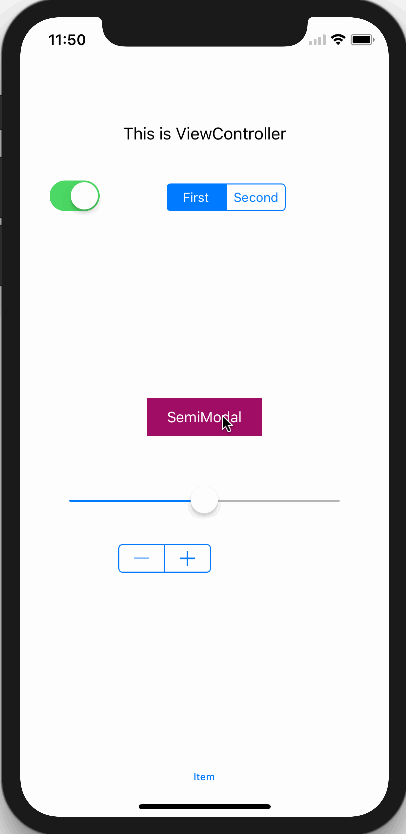
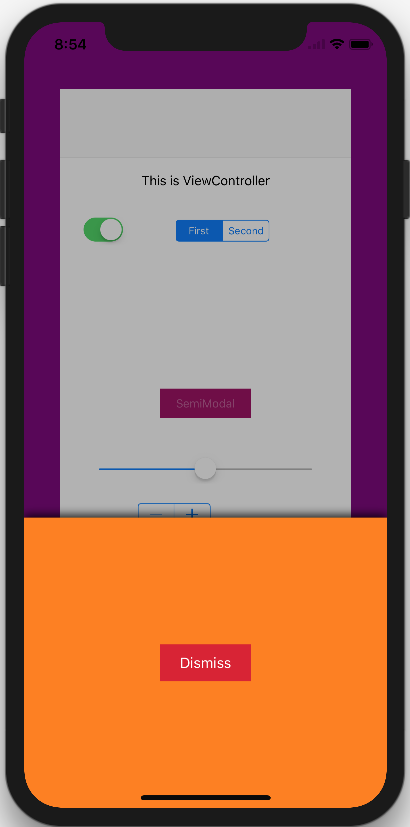
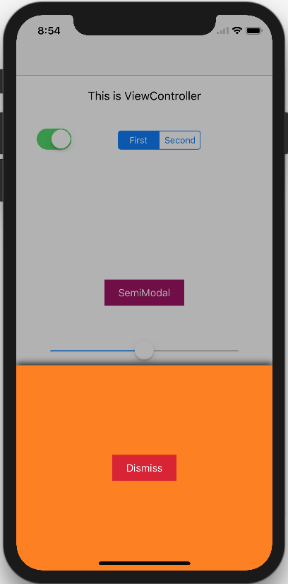

# SemiModal

[]()
[]()
[]()
[]()


类似淘宝添加购物车的模态视图动画

参考了[KNSemiModalViewController](https://github.com/kentnguyen/KNSemiModalViewController)的代码，但由于KNSemiModalViewController毕竟年代久远，当时还是用的addChildViewController的方式去实现的，所以现在采用iOS7提供的转场动画API以及iOS8推出的`UIPresentationController`来实现该功能。


## 环境要求

- iOS8.0+
- Swift4.0
- Xcode9.0+


## 用法

- 将`UIViewController+SemiModal.swift`拖入你的项目即可

- 示例代码

1. 弹出控制器

```Swift
let contentViewController = UIViewController()
contentViewController.view.backgroundColor = .purple
presentSemiModalViewController(vc, contentHeight: 300.0, configuration: .default, completion: nil)
```

2. 弹出自定义视图

```Swift
let contentView = UIView()
contentView.backgroundColor = .purple
presentSemiModalView(contentView, contentHeight: 300.0, configuration: .default) {
	// 3s后自动关闭
	DispatchQueue.main.asyncAfter(deadline: .now()+3.0, execute: {
		self.presentedViewController?.dismiss(animated: true, completion: nil)
	})
}
```

## 演示

[]()

[]()

[]()

## 致谢

参考了[KNSemiModalViewController](https://github.com/kentnguyen/KNSemiModalViewController)的代码，感谢他们对开源社区做出的贡献。

## 协议

`SemiModal`被许可在 MIT 协议下使用。查阅`LICENSE`文件来获得更多信息。
